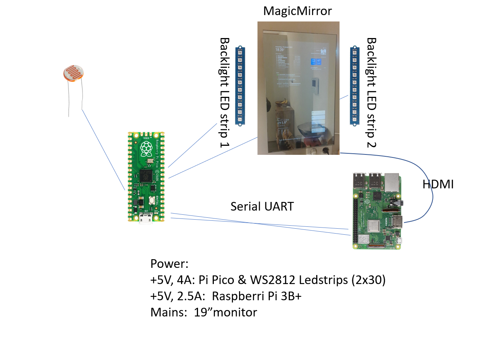
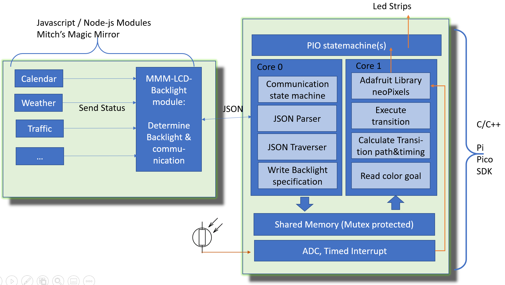
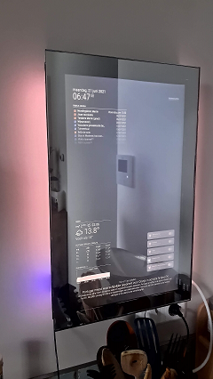
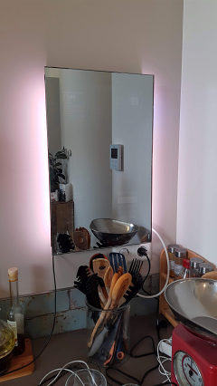
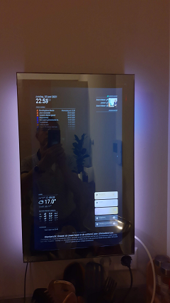

# MMM-LCD-Backlight

This <a href="https://github.com/MichMich/MagicMirror">MagicMirror</a> module steers a pi pico LED strip backlighting. It actually is more of a project than a module only. 

The projects add backlights to my Magic Mirror, where the lighting  changes depending the information on the screen. So it is even easier to see if traffic jams or bad weather is expected.  


## Installation (needs hardware and software)

To do this project some basic proficiency in using Rasberry Pi and Raspberry Pi PICO (C/C++ SDK) and hardware set-ups is assumed. Privided you have adequate background knowlegde, guidance for missing details to build this project can easily be found on the raspberry pi organisation's offical documentation. (Complexity: ~~beginner~~ / advanced / ~~expert~~). 

1. Navigate into your MagicMirror's `modules` folder and execute `git clone https://github.com/martinkooij/MMM-LCD-Backlight.git`.
2. go to the MMM-LCD-Backlight folder and execute `npm install`
3. Add backlighting info (positions, pixels, strands, defaultcolor, etc..) in config.js of MagicMirror. 
4. Install or change the relevant modules to send out backlighting commands depending on their state. I modified MMM-rainfc to send out "RAIN" when rain is expected, and MMM-Bose-soundtouch to send out "ART" when art is displayed, MMM-traffic module to send out "BUSY" or "JAMMED" depending on traffic condition, and working on the calender module to send out "24H" or "2H" if something is scheduled. The modules should send out the command "-1" if background colors should be displayed again. The MMM-LCD-Backlight is listening to these commands via the module communication to react on commands received according to the config.js file.

5. Compile the C and C++ code for Pi PICO SDK (tested on SDK 1.2.0. Compile by creating a directory "build", do `cd build`and run Cmake and Make as per your toolchain on linux or windows depending. Install the created backlight.uf2 file on Pico
6. Wire the PICO on pin 0 and 1 (UART) to the rasberri pi GPIO 14 and GPIO 15. I connected the built-in PL011 serial on these Pins and removed bluetooth and serial console interactions, disabled the mini-uart , so I am not dependent on the variable Pi3B+ core clock for serial speed.
7. Wire two LED WS2812 strips of 50cm (30 leds) with separate 5V (4Amp, 18W) feed  on pins 5 and 6 respectively on Pico. Connect ground. Feed Pico via any 5V lead and zener diode on VSYS pin. For other sizes and/or pins you can change #DEFINE parameters in the code. 

## Config

example of a config file: 

````javascript
{
	module: "MMM-LCD-Backlight",
		config: {
			nStrings: 2,  		// There are two strings
			nPixels: [30,30],		// Each string has 30 leds
			defaultColor: {r: 255, g: 167, b: 87 },   // default = warm white 2700K
			serialPortname: "/dev/serial0",  //that how I configured and named the serial port on my RASP PI3B+ towards the PICO
			colorCommands: {
				"MMM-Bose-Soundtouch": [ // list of commands that can be received from MMM-Bose-Soundtouch
					{ command: "ART",
					  strand: 2,
					  pixelstart: 3 // using pixel 3,4,5,6 and 7 of LEDstring 2. 
					  //5 pixels are sent by the modules as parameters, depending on dominant colors of the art
					  // no need to specify them here. 
					}],
				"MMM-rainfc": [ // list of commands that can be received from MMM-rainfc
					{ command: "RAIN",
					  strand: 1,
					  pixelstart: 25,
					  pixels: [{r:0,g:0,b:255},{r:0,g:0,b:255},{r:0,g:0,b:255}]  // three blue pixels when rain is expected
					}]
			},	
			transitionTime: 2000 // time to transition between the colors. 
		}
},
````

## Highlights of the project
- Magic Mirror Modules (from https://github.com/MichMich/MagicMirror) are enhanced to emit “backlight commands”. Examples can be found in https://github.com/martinkooij/MMM-rainfc (basic) and in https://github.com/martinkooij/MMM-Bose-Soundtouch (advanced).
- The MMM-LCD-Backlight module interprets the module commands to pixel lighting command (as per definitions in the Magic Mirror’s config.js file) and communicates results via serial line in JSON format.  (https://github.com/martinkooij/MMM-LCD-Backlight). 
The modules treates multiple incoming commands as idempotent, so modules can send the same command without "eating" too many resources. This design pattern of sending a backlighting command each time something on the screen is updated (even if it is the same command as before and nothing needs to change) is actually encouraged as it makes it more stable in case of loss of communication 
- Core0 of Pi Pico is in continuous loop: picking up the JSON formatted backlight communications from the pi 3B+, disassembling the JSON and writing the goal colors per strand to protected shared memory. (https://github.com/martinkooij/jsml-traverser en https://github.com/martinkooij/pi-pico-mirror-backlight). 
- Core1 of pi Pico is also in continuous loop. It reads the shared memory, determines if there are changes and calculates an aesthetically pleasing color transition towards the goal from the current state. It uses an pi Pico adapted Adafruit library to steer two WS2812 LED strings (https://github.com/martinkooij/pi-pico-adafruit-neopixels) 
- Reliability: A shared kicker checks whether core0 & core1 are both alive and then kicks the hardware watchdogtimer. In case of stalling any one of the two cores a reboot of the Pi PICO will occur and it will happily pick up the work again.  
- Adaption to environment: An LDR is connected to an ADC to adapt  pixel brightness to the environmental lighting conditions. 

### Hardware & Wiring


### Software architecture


## The result in Pictures

  


## Acknowledgements
To make this project I stood on the shoulders of:
- Rasberry Pi & Raspberry Pi PICO team and the many examples in the C/C++ SDK. Thanks!
- Adafruit Neopixel library, that I copied and stripped to use Pi Pico internal hardware for timings. Main challenge: cooperative constructors and destructors of multiple strands. 
- JSMN (Jasmine) JSON parser/tokenizer in C. I loved the speed and the low memory usage in my application!
- My education from the 80’s: Parsing and state machine driven communication protocols. I hated navigating through the JSMN tokens in my C code, so I wrote an efficient C++ JSMN token navigator and implemented state machine protocol for exchanging JSON messages between Pi 3 en Pico. 
- Last but not least: Magic Mirror project / framework by Mitch. 


## Version
July 2021: First release.

The MIT License (MIT)
=====================

Copyright © 2018/2019 SpoturDeal - Carl 

Permission is hereby granted, free of charge, to any person
obtaining a copy of this software and associated documentation
files (the “Software”), to deal in the Software without
restriction, including without limitation the rights to use,
copy, modify, merge, publish, distribute, sublicense, and/or sell
copies of the Software, and to permit persons to whom the
Software is furnished to do so, subject to the following
conditions:

The above copyright notice and this permission notice shall be
included in all copies or substantial portions of the Software.

**The software is provided “as is”, without warranty of any kind, express or implied, including but not limited to the warranties of merchantability,
fitness for a particular purpose and noninfringement. In no event shall the authors or copyright holders be liable for any claim, damages or other liability,
whether in an action of contract, tort or otherwise, arising from, out of or in connection with the software or the use or other dealings in the software.**
